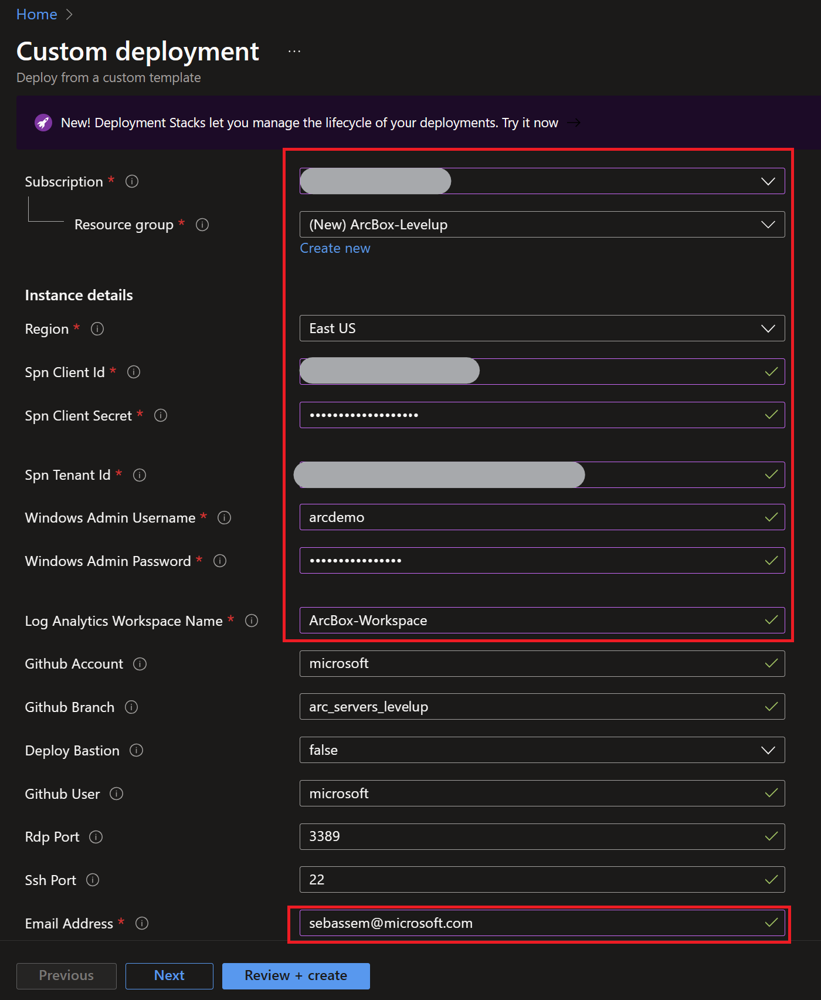
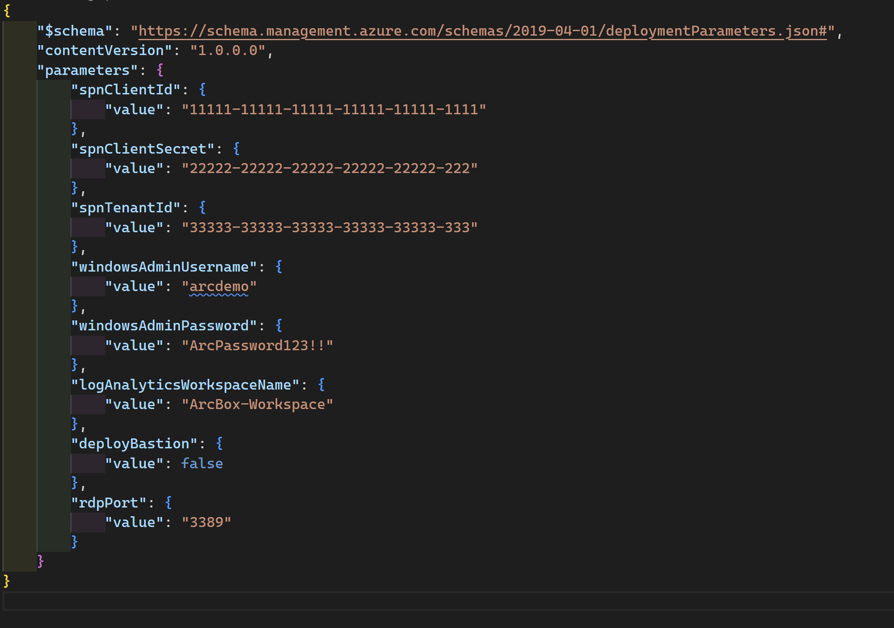
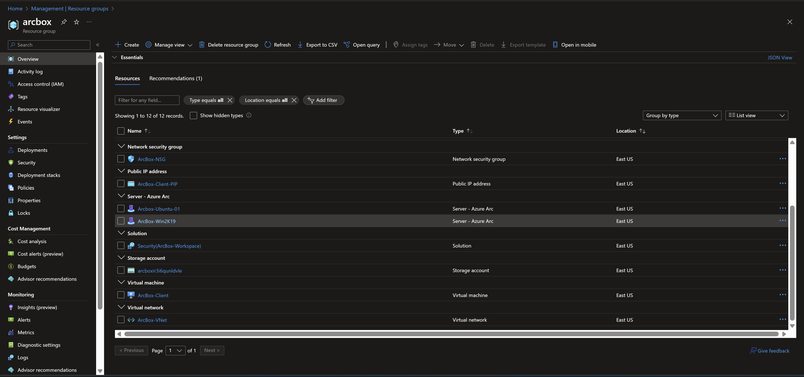
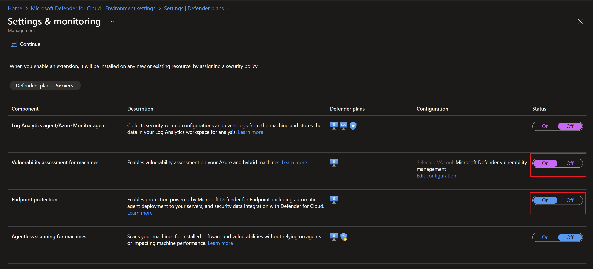
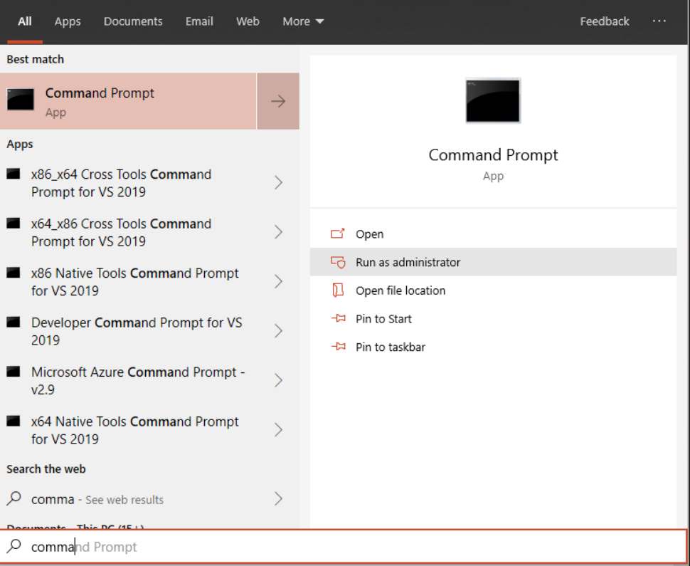

# Azure Arc-enabled servers LevelUp Training

## Goals

The purpose of this workshop is to train Microsoft employees who are working in the filed with the Azure Arc-enabled server concepts, features, value proposition, and do hands on training to help customers deploy Azure Arc-enabled servers.

After completion of this workshop, you will be able to:

- Understand pre-requisites to onboard Windows and Linux servers to Azure Arc
- Onboard Windows and Linux servers running using different onboarding methods
- Secure your Azure Arc-enabled servers using Microsoft Defender for servers
- Monitor your Azure Arc-enabled servers using Azure Monitor
- Configure your Azure Arc-enabled servers using Azure Automanage machine configuration
- Monitor changes to your Azure Arc-enabled servers using Change tracking and inventory
- Keep your Azure Arc-enabled servers patched using Update Management Center
- Run scripts on your Azure Arc-enabled servers using Custom script extensions
- Run automation runbooks on your Azure Arc-enabled servers using Hybrid runbook workers
- SSH into your Azure Arc-enabled servers using SSH access
- Manage your Azure Arc-enabled servers using Admin Center (Preview)
- Query and inventory your Azure Arc-enabled servers using Azure resource graph
- Enforce governance across your Azure Arc-enabled servers using Azure Policy

| LevelUp Module | Duration | Facilitator |
|---------------|---------------|---------------|
| **1. Onboard Windows and Linux servers running using different onboarding methods** | x minutes | Owner |
|**2. Monitor your Azure Arc-enabled servers using Azure Monitor** | x minutes | Owner |
|**3. Secure your Azure Arc-enabled servers using Microsoft Defender for servers** | x minutes | Owner |
|**4. Configure your Azure Arc-enabled servers using Azure Automanage machine configuration** | x minutes | Owner |
|**5. Monitor changes to your Azure Arc-enabled servers using Change tracking and inventory** | x minutes | Owner |
|**6. Keep your Azure Arc-enabled servers patched using Update Management Center** | x minutes | Owner |
|**7. Run scripts on your Azure Arc-enabled servers using Custom script extensions** | x minutes | Owner |
|**8. Run automation runbooks on your Azure Arc-enabled servers using Hybrid runbook workers** | x minutes | Owner |
|**9. SSH into your Azure Arc-enabled servers using SSH access** | x minutes | Owner |
|**10. Manage your Azure Arc-enabled servers using Admin Center (Preview)** | x minutes | Owner |
|**11. Query and inventory your Azure Arc-enabled servers using Azure resource graph** | x minutes | Owner |
|**12. Enforce governance across your Azure Arc-enabled servers using Azure Policy** | x minutes | Owner |

## LevelUp Lab Environment

ArcBox LevelUp edition is a special “flavor” of ArcBox that is intended for users who want to experience Azure Arc-enabled servers' capabilities in a sandbox environment. Screenshot below shows layout of the lab environment.

  

### Prerequisites

- [Install or update Azure CLI to version 2.51.0 and above](https://docs.microsoft.com/cli/azure/install-azure-cli?view=azure-cli-latest). Use the below command to check your current installed version.

  ```shell
  az --version
  ```

    

- Login to AZ CLI using the ```az login``` command.

```shell
az login
```

- Ensure that you have selected the correct subscription you want to deploy ArcBox to by using the ```az account list --query "[?isDefault]"``` command. If you need to adjust the active subscription used by Az CLI, follow [this guidance](https://docs.microsoft.com/cli/azure/manage-azure-subscriptions-azure-cli#change-the-active-subscription).

- ArcBox must be deployed to one of the following regions. **Deploying ArcBox outside of these regions may result in unexpected results or deployment errors.**

  - East US
  - East US 2
  - Central US
  - West US 2
  - North Europe
  - West Europe
  - France Central
  - UK South
  - Australia East
  - Japan East
  - Korea Central
  - Southeast Asia

- **ArcBox requires 16 DSv4-series vCPUs** when deploying with default parameters such as VM series/size. Ensure you have sufficient vCPU quota available in your Azure subscription and the region where you plan to deploy ArcBox. You can use the below Az CLI command to check your vCPU utilization.

  ```shell
  az vm list-usage --location <your location> --output table
  ```

  

- Register necessary Azure resource providers by running the following commands.

  ```shell
  az provider register --namespace Microsoft.HybridCompute --wait
  az provider register --namespace Microsoft.GuestConfiguration --wait
  az provider register --namespace Microsoft.AzureArcData --wait
  az provider register --namespace Microsoft.OperationsManagement --wait
  ```

- Create Azure service principal (SP). To deploy ArcBox, an Azure service principal assigned with the _Owner_ Role-based access control (RBAC) role is required. You can use Azure Cloud Shell (or other Bash shell), or PowerShell to create the service principal.

  - (Option 1) Create service principal using [Azure Cloud Shell](https://shell.azure.com/) or Bash shell with Azure CLI:

    ```shell
    subscriptionId="<Your Subscription Id>"
    servicePrincipalName="<Unique Service principal name>"

    az account set -s $subscriptionId
    az ad sp create-for-rbac -n $servicePrincipalName --role "Owner" --scopes /subscriptions/$subscriptionId
    ```

    For example:

    ```shell
    subscriptionId="98471a83-9151-489e-uub1-463447bed604"
    servicePrincipalName="JumpstartArcBoxSPN"

    az account set -s $subscriptionId
    az ad sp create-for-rbac -n $servicePrincipalName --role "Owner" --scopes /subscriptions/$subscriptionId
    ```

    Output should look similar to this:

    ```json
    {
    "appId": "XXXXXXXXXXXXXXXXXXXXXXXXXXXX",
    "displayName": "JumpstartArcBoxSPN",
    "password": "XXXXXXXXXXXXXXXXXXXXXXXXXXXX",
    "tenant": "XXXXXXXXXXXXXXXXXXXXXXXXXXXX"
    }
    ```

  - (Option 2) Create service principal using PowerShell. If necessary, follow [this documentation](https://learn.microsoft.com/powershell/azure/install-az-ps?view=azps-8.3.0) to install Azure PowerShell modules.

    ```PowerShell
    $account = Connect-AzAccount
    $subscriptionId = "<Your Subscription Id>"
    $servicePrincipalName = "<Unique Service principal name>"

    Set-AzContext -SubscriptionId $subscriptionId
    $spn = New-AzADServicePrincipal -DisplayName $servicePrincipalName -Role "Owner" -Scope "/subscriptions/$subscriptionId"
    echo "SPN App id: $($spn.AppId)"
    echo "SPN secret: $($spn.PasswordCredentials.SecretText)"
    ```

    For example:

    ```PowerShell
    $account = Connect-AzAccount
    $subscriptionId = "98471a83-9151-489e-uub1-463447bed604"
    $servicePrincipalName = "JumpstartArcBoxSPN"

    Set-AzContext -SubscriptionId $subscriptionId
    $spn = New-AzADServicePrincipal -DisplayName $servicePrincipalName -Role "Owner" -Scope "/subscriptions/$subscriptionId"
    echo "SPN App id: $($spn.AppId)"
    echo "SPN secret: $($spn.PasswordCredentials.SecretText)"
    ```

    Output should look similar to this:

    

    > **NOTE: If you create multiple subsequent role assignments on the same service principal, your client secret (password) will be destroyed and recreated each time. Therefore, make sure you grab the correct password.**

    > **NOTE: The Jumpstart scenarios are designed with as much ease of use in-mind and adhering to security-related best practices whenever possible. It is optional but highly recommended to scope the service principal to a specific [Azure subscription and resource group](https://docs.microsoft.com/cli/azure/ad/sp?view=azure-cli-latest) as well considering using a [less privileged service principal account](https://docs.microsoft.com/azure/role-based-access-control/best-practices)**

### Deployment

#### Deployment Option 1: Azure portal

- Click the <a href="https://portal.azure.com/#create/Microsoft.Template/uri/https%3A%2F%2Fraw.githubusercontent.com%2Fsebassem%2Fazure_arc%2Farc_servers_level_up%2Fazure_jumpstart_arcbox_servers_levelup%2FARM%2Fazuredeploy.json" target="_blank"></a> button and enter values for the the ARM template parameters.

  

  

  

    > **NOTE: The deployment takes around 20 minutes to complete.**

    > **NOTE: If you see any failure in the deployment, please check the [troubleshooting guide](https://azurearcjumpstart.io/azure_jumpstart_arcbox/itpro/#basic-troubleshooting).**

### Deployment Option 2: Bicep deployment via Azure CLI

- Clone the Azure Arc Jumpstart repository

  ```shell
  $folderPath = <Specify a folder path to clone the repo>

  Set-Location -Path $folderPath
  git clone -b arc_servers_level_up https://github.com/microsoft/azure_arc.git
  Set-Location -Path "azure_arc\azure_jumpstart_arcbox_servers_levelup\bicep"
  ```

- Upgrade to latest Bicep version

  ```shell
  az bicep upgrade
  ```

- Edit the [main.parameters.json](https://github.com/sebassem/azure_arc/blob/arc_servers_level_up/azure_jumpstart_arcbox_servers_levelup/bicep/main.parameters.json) template parameters file and supply some values for your environment.
  - _`spnClientId`_ - Your Azure service principal id
  - _`spnClientSecret`_ - Your Azure service principal secret
  - _`spnTenantId`_ - Your Azure tenant id
  - _`windowsAdminUsername`_ - Client Windows VM Administrator name
  - _`windowsAdminPassword`_ - Client Windows VM Password. Password must have 3 of the following: 1 lower case character, 1 upper case character, 1 number, and 1 special character. The value must be between 12 and 123 characters long.
  - _`logAnalyticsWorkspaceName`_ - Unique name for the ArcBox Log Analytics workspace

  

- Now you will deploy the Bicep file. Navigate to the local cloned [deployment folder](https://github.com/microsoft/azure_arc/tree/main/azure_jumpstart_arcbox/bicep) and run the below command:

  ```shell
  az group create --name "<resource-group-name>" --location "<preferred-location>"
  az deployment group create -g "<resource-group-name>" -f "main.bicep" -p "main.parameters.json"
  ```

    > **NOTE: If you see any failure in the deployment, please check the [troubleshooting guide](https://azurearcjumpstart.io/azure_jumpstart_arcbox/itpro/#basic-troubleshooting).**

    > **NOTE: The deployment takes around 20 minutes to complete.**

### Connecting to the ArcBox Client virtual machine

Various options are available to connect to _ArcBox-Client_ VM, depending on the parameters you supplied during deployment.

- [RDP](https://azurearcjumpstart.io/azure_jumpstart_arcbox/ITPro/#connecting-directly-with-rdp) - available after configuring access to port 3389 on the _ArcBox-NSG_, or by enabling [Just-in-Time access (JIT)](https://azurearcjumpstart.io/azure_jumpstart_arcbox/ITPro/#connect-using-just-in-time-accessjit).
- [Azure Bastion](https://azurearcjumpstart.io/azure_jumpstart_arcbox/ITPro/#connect-using-azure-bastion) - available if ```true``` was the value of your _`deployBastion`_ parameter during deployment.

#### Connecting directly with RDP

By design, ArcBox does not open port 3389 on the network security group. Therefore, you must create an NSG rule to allow inbound 3389.

- Open the _ArcBox-NSG_ resource in Azure portal and click "Add" to add a new rule.

  

  

- Specify the IP address that you will be connecting from and select RDP as the service with "Allow" set as the action. You can retrieve your public IP address by accessing [https://icanhazip.com](https://icanhazip.com) or [https://whatismyip.com](https://whatismyip.com).

  

  

  

#### Connect using Azure Bastion

- If you have chosen to deploy Azure Bastion in your deployment, use it to connect to the VM.

  

  > **NOTE: When using Azure Bastion, the desktop background image is not visible. Therefore some screenshots in this guide may not exactly match your experience if you are connecting to _ArcBox-Client_ with Azure Bastion.**

#### Connect using just-in-time access (JIT)

If you already have [Microsoft Defender for Cloud](https://docs.microsoft.com/azure/defender-for-cloud/just-in-time-access-usage?tabs=jit-config-asc%2Cjit-request-asc) enabled on your subscription and would like to use JIT to access the Client VM, use the following steps:

- In the Client VM configuration pane, enable just-in-time. This will enable the default settings.

  

  

  

#### The Logon scripts

- Once you log into the _ArcBox-Client_ VM, multiple automated scripts will open and start running. These scripts usually take 10-20 minutes to finish, and once completed, the script windows will close automatically. At this point, the deployment is complete.

  

- Deployment is complete! Let's begin exploring the features of Azure Arc-enabled servers with the Level-up modules.

  

  

## Modules

### Module 1: On-boarding to Azure Arc-enabled servers

#### Module overview

#### Task 1

#### Task 2

### Module 2: Monitor your Azure Arc-enabled servers using Azure Monitor

#### Module overview

#### Task 1

#### Task 2

### Module 3: Secure your Azure Arc-enabled servers using Microsoft Defender for servers

#### Module overview

In this module, you will learn how to enable and leverage Microsoft Defender for Servers to secure your Azure Arc-enabled servers using capabilities like Defender for Endpoint, vulnerability assessment and threat detection via alerts.

#### Task 1: Pre-requisites

> **NOTE: In the previous module, you should have already deployed the Azure Monitor agent (AMA) to you Arc-enabled servers. If you have not deployed it, follow the following steps in module 2 to deploy it otherwise skip to task 2**

#### Task 2: Enable the Defender for Servers plan

- From the Azure home page, search for defender and select Microsoft Defender for Cloud.

    

- If you already have Defender plans setup at your subscription level, you may find that Defender is already turned on for your Arc-enabled servers. However, if Defender is not enabled, select _Environment settings_ from the Management section on the left blade.

    

- Expand the Tenant Root Group, and then select your subscription.

- Enable the plan for servers, you can select either _Plan 1_ or _Plan 2_ for this exercise

    

- Click on the settings option in the _Monitoring coverage_ and enable the following capabilities:
  - Vulnerability assessment for machines
  - Endpoint protection

    

- Click Save.

    

#### Task 3: Detect threats on your servers using alerts

- To simulate a malicious activity on the _Win2k19_ servers, rdp into the _ArcBox-Client_ VM
- Go to Start and type cmd.
- Right-select Command Prompt and select Run as administrator

    

- Run the following command:

```shell
$remoteScriptFile = "$agentScript\testDefenderForServers.ps1"
$Win2k22vmName = "ArcBox-Win2K22"
$nestedWindowsUsername = "Administrator"
$nestedWindowsPassword = "ArcDemo123!!"
$secWindowsPassword = ConvertTo-SecureString $nestedWindowsPassword -AsPlainText -Force
$winCreds = New-Object System.Management.Automation.PSCredential ($nestedWindowsUsername, $secWindowsPassword)
$cmdExePath = "C:\Windows\System32\cmd.exe"
$cmdArguments = "/C `"$remoteScriptFile`""

Invoke-Command -VMName $Win2k22vmName -ScriptBlock { Start-Process -FilePath $Using:cmdExePath -ArgumentList $cmdArguments } -Credential $winCreds
```

- The Command Prompt window closes automatically. If successful, a new alert should appear in Defender for Cloud Alerts blade in 10 minutes.

  > **NOTE: You should already see an alert for the Win2k22 Arc-enabled server**

### Module 4: Configure your Azure Arc-enabled servers using Azure Automanage machine configuration

#### Module overview

#### Task 1

#### Task 2

### Module 5: Monitor changes to your Azure Arc-enabled servers using Change tracking and inventory

#### Module overview

#### Task 1

#### Task 2

### Module 6: Keep your Azure Arc-enabled servers patched using Update Management Center

#### Module overview

#### Task 1

#### Task 2

### Module 7: Run scripts on your Azure Arc-enabled servers using Custom script extensions

#### Module overview

#### Task 1

#### Task 2

### Module 8: Run automation runbooks on your Azure Arc-enabled servers using Hybrid runbook workers

#### Module overview

#### Task 1

#### Task 2

### Module 9: SSH into your Azure Arc-enabled servers using SSH access

#### Module overview

#### Task 1

#### Task 2

### Module 10: Manage your Azure Arc-enabled servers using Admin Center (Preview)

#### Module overview

#### Task 1

#### Task 2

### Module 11: Query and inventory your Azure Arc-enabled servers using Azure resource graph

#### Module overview

#### Task 1

#### Task 2

### Module 12: Enforce governance across your Azure Arc-enabled servers using Azure Policy

#### Module overview

#### Task 1

#### Task 2